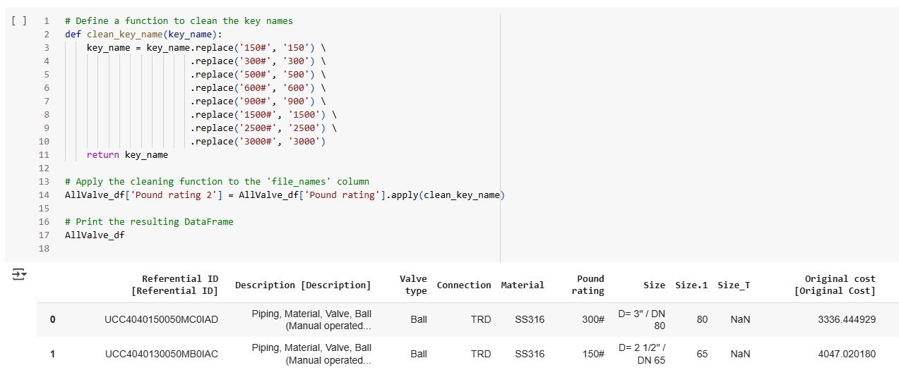
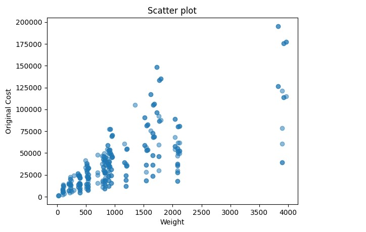
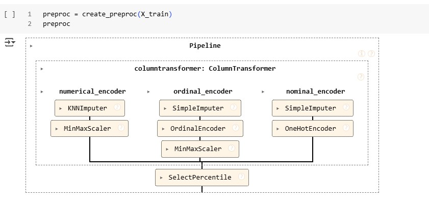
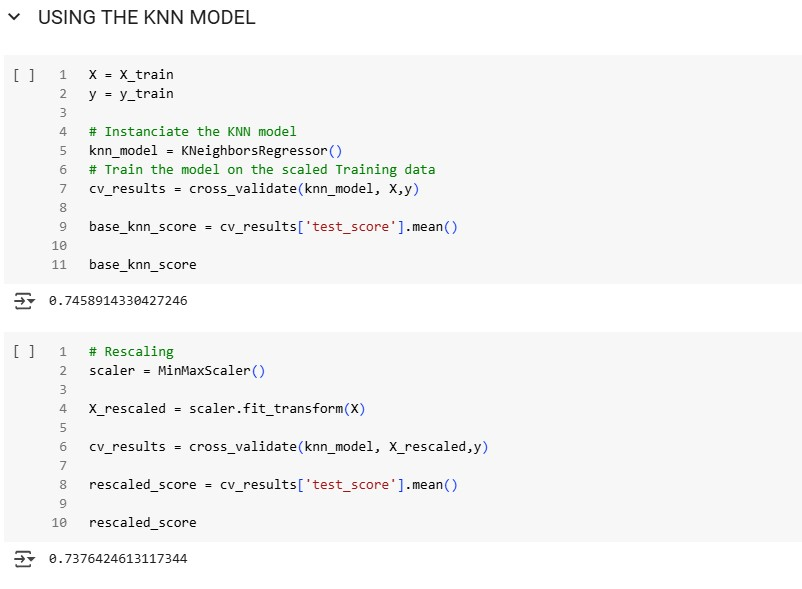
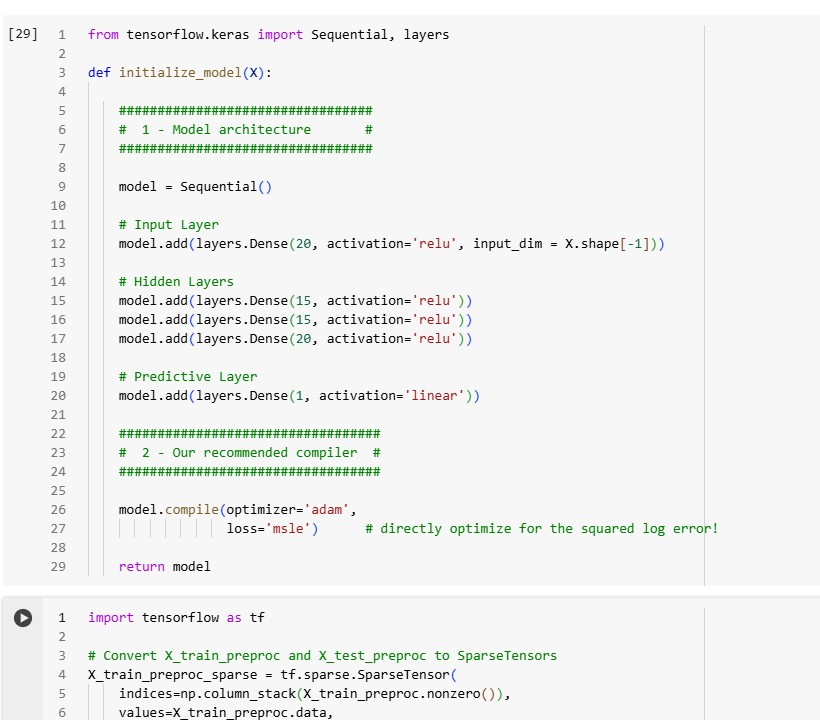

# Machine Learning-Based Valve Cost Estimation

## Project Overview
This project leverages machine learning to predict the costs of industrial valves made from rare materials such as Titanium, Hastelloy, and Alloy 20 (materials that are not readily available and often lack complete cost data). By analyzing key factors such as valve type, connection type, size, pressure rating, material composition, and market material costs, the model fills in missing data and enhances cost estimations. 

**Project goal:** To develop accurate cost models that empower engineering and procurement teams to make more informed decisions and improve budgeting accuracy.

## Data Sources
- **Historical Cost Data**: Centralized records from multiple engineering projects
- **Cleopatra Costing Database**: A comprehensive costing database that includes additional valve specifications and pricing information, extensively used in the industry for accurate cost estimation of engineering projects.

## Methodology & Tools
### 1. Data Processing & Preparation
- **Data Cleaning & Manipulation**: Utilizing Python, Pandas, and NumPy to clean and manipulate the dataset.
- **Feature Engineering**: Applying Column Transformer, Ordinal Encoding, One-Hot Encoding, MinMax Scaling, and SelectPercentile to prepare features for modeling.

  

### 2. Exploratory Data Analysis (EDA)
- **Visualization Tools**: Using Matplotlib and Seaborn to visualize data.
- **Key Insights**: Identified weight, size, and pressure rating as primary cost drivers through scatter plots and other visualizations.

  

### 3. Machine Learning Models & Techniques
- **Imputation Techniques**: Employed Iterative Imputer and KNN Imputer to handle missing data.

  
  
- **Model Development**: Leveraged Scikit-Learn for Linear Regression, K-Nearest Neighbors, and Deep Learning models.

  

  

  

- **Neural Network Implementation**: Developed deep learning-based cost prediction models using TensorFlow and Keras.

  

## Results & Impact
- **Correlation Analysis**: Discovered key factors influencing cost (weight, size, pressure rating)
- **Model Accuracy**: Achieved an 80% improvement in cost estimation accuracy
- **Data Visualization**: Created scatter plots and heatmaps to illustrate trends
- **Neural Network Performance**: Developed a predictive model with a low RMSLE (Root Mean Squared Logarithmic Error)
- **Practical Application**: Successfully generated cost predictions for new data, with results exported to Excel for use by the Estimation team

## Conclusion
This project highlights the power of machine learning in improving cost estimation for industrial components. By effectively handling missing data and leveraging predictive models, we significantly enhanced estimation accuracy. The results demonstrate how data-driven approaches can optimize cost analysis, reduce uncertainty, and support better decision-making in engineering and procurement. Future improvements could include integrating real-time cost updates and refining deep learning models for even higher precision.
